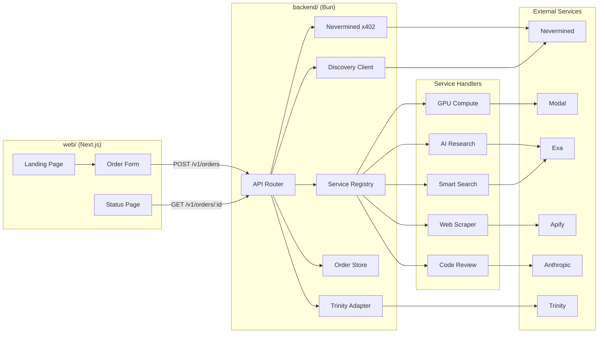
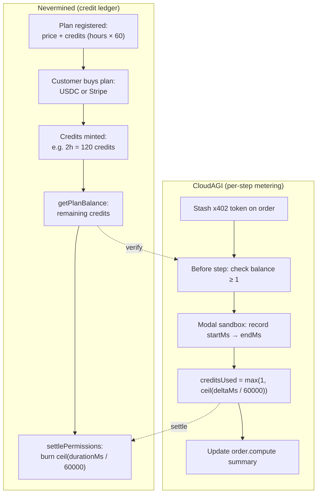
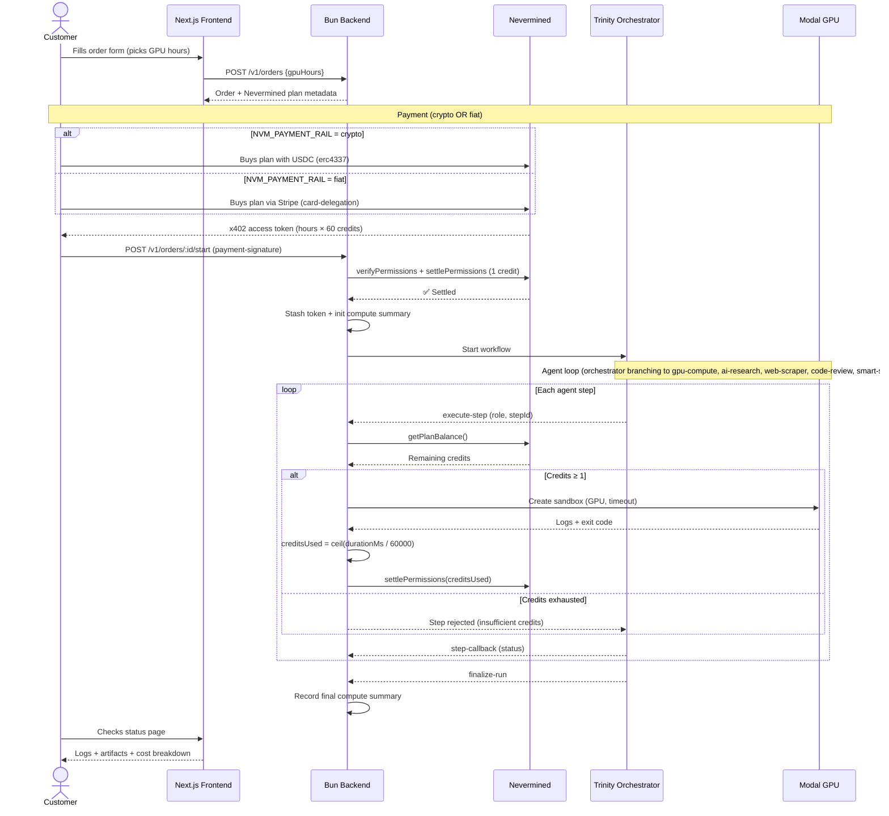
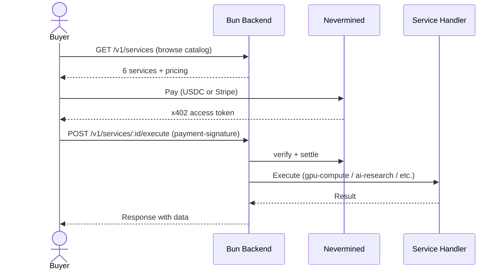

<p align="center">
  
</p>

# CloudAGI

CloudAGI is a multi-service AI platform on the Nevermined marketplace. It exposes a branch orchestrator agent on top of the existing leaf agents for GPU compute, neural search, web scraping, AI code review, and smart search, all paid via the x402 protocol.

## Live URLs

| URL | Description |
|-----|-------------|
| [cloudagi.org](https://cloudagi.org) | Frontend (Next.js UI) |
| [api.cloudagi.org](https://api.cloudagi.org) | Backend API |
| [api.cloudagi.org/v1/services](https://api.cloudagi.org/v1/services) | Service catalog |
| [api.cloudagi.org/.well-known/agent.json](https://api.cloudagi.org/.well-known/agent.json) | A2A agent card |
| [api.cloudagi.org/v1/health](https://api.cloudagi.org/v1/health) | Health check |

## Available Services

All services are billed per-call via USDC over x402 on Base Sepolia.

| Service | Endpoint | Price | Provider |
|---------|----------|-------|----------|
| Branch Orchestrator | `POST /v1/services/orchestrator/execute` | $25.00 | Trinity + Routing |
| GPU Compute | `POST /v1/services/gpu-compute/execute` | $1.00 | Modal |
| Code Review | `POST /v1/services/code-review/execute` | $0.50 | Claude Sonnet 4.6 |
| Web Scraper | `POST /v1/services/web-scraper/execute` | $0.20 | Apify |
| AI Research | `POST /v1/services/ai-research/execute` | $0.10 | Exa |
| Smart Search | `POST /v1/services/smart-search/execute` | $0.05 | Multi-source |

### Quick Start — Call a Service (3 steps)

```bash
# 1. Install SDK
npm install @nevermined-io/payments

# 2. Set env vars
export NVM_API_KEY=sandbox:your-key
export NVM_ENVIRONMENT=sandbox

# 3. Call any service
curl -X POST https://api.cloudagi.org/v1/services/smart-search/execute \
  -H "Content-Type: application/json" \
  -H "PAYMENT-SIGNATURE: <your-x402-token>" \
  -d '{ "query": "latest AI agent frameworks" }'
```

Each call requires a fresh x402 access token. Get one via the Nevermined SDK:

```typescript
import { Payments } from "@nevermined-io/payments";

const payments = Payments.getInstance({
  nvmApiKey: process.env.NVM_API_KEY!,
  environment: "sandbox",
});

// Order plan (one-time), then get token per call
await payments.plans.orderPlan(PLAN_ID);
const { accessToken } = await payments.x402.getX402AccessToken(PLAN_ID, AGENT_ID);
```

Plan and Agent IDs for each service are listed in the [agent card](https://api.cloudagi.org/.well-known/agent.json).

## Architecture

```
CloudAGI/
├── backend/               # Bun API (TypeScript)
│   ├── src/
│   │   ├── index.ts       # HTTP router + all endpoints
│   │   ├── config.ts      # Env-based configuration
│   │   ├── services/      # Marketplace service handlers
│   │   │   ├── registry.ts
│   │   │   ├── init.ts
│   │   │   └── handlers/
│   │   │       ├── orchestrator.ts  # Branch agent over Trinity + leaf delegation
│   │   │       ├── gpu-compute.ts   # Modal sandbox execution
│   │   │       ├── ai-research.ts   # Exa neural search
│   │   │       ├── web-scraper.ts   # Apify web scraping
│   │   │       ├── code-review.ts   # Claude code analysis
│   │   │       └── smart-search.ts  # Multi-source aggregator
│   │   ├── discovery/     # Nevermined Discovery API client
│   │   ├── payments/      # x402 verification + settlement + balance
│   │   ├── jobs/          # Modal GPU job execution + compute tracking
│   │   ├── orders/        # Order state + compute summary
│   │   ├── orchestration/ # Trinity workflow adapter
│   │   └── scripts/       # Registration + purchasing scripts
│   │       ├── register-nevermined.ts    # Register agent + plan
│   │       ├── buy-from-marketplace.ts   # Discover + buy from sellers
│   │       └── bulk-buy.ts              # Mass-purchase for leaderboard
│   ├── .env.example       # Local dev env template
│   └── .env.production    # Production env template
├── purchaser/             # Python purchaser agent
│   └── pay_and_call.py    # Buy + call via payments_py SDK
├── web/                   # Next.js frontend
│   ├── app/
│   └── .env.example
└── reference/             # Nevermined hackathon examples (gitignored)
```

## System Flow



## Payment and Cost Tracking

**1 credit = 1 GPU-minute.** Customer picks hours, Nevermined mints `hours × 60` credits. CloudAGI settles credits per Trinity step based on actual wall-clock time.



| Layer          | Tracks                                            | Example                                             |
| -------------- | ------------------------------------------------- | --------------------------------------------------- |
| **Nevermined** | Credit balance, settlements, payment tx           | "120 credits minted, 13 settled, 107 remaining"     |
| **CloudAGI**   | Per-step durationMs, creditsUsed, compute summary | "gpu-compute: 503000ms → 9 credits; total: 13 credits" |
| **Modal**      | GPU-seconds billed to our account                 | "4 sandboxes, 188 GPU-seconds total"                |

## Transaction Flow

### Trinity orchestration (primary)



### Direct service execution



## API Endpoints

### Public

| Method | Path                      | Description                   |
| ------ | ------------------------- | ----------------------------- |
| GET    | `/`                       | Service info                  |
| GET    | `/v1/health`              | Health check                  |
| GET    | `/.well-known/agent.json` | A2A agent card (all services) |
| GET    | `/v1/services`            | Service catalog               |
| GET    | `/v1/services/:id`        | Service details + pricing     |

### Paid (x402)

| Method | Path                       | Description                                                  |
| ------ | -------------------------- | ------------------------------------------------------------ |
| POST   | `/v1/services/:id/execute` | Execute a service (single call, 1 credit)                    |
| POST   | `/v1/orders/:id/start`     | Start Trinity run (per-step settlement, `ceil(min)` credits) |

### Discovery

| Method | Path                   | Description                  |
| ------ | ---------------------- | ---------------------------- |
| GET    | `/v1/discover/sellers` | Find other Nevermined agents |
| GET    | `/v1/discover/buyers`  | Find potential buyers        |

### Orders

| Method | Path                             | Description                               |
| ------ | -------------------------------- | ----------------------------------------- |
| POST   | `/v1/orders`                     | Create order (`{gpuHours, command, ...}`) |
| POST   | `/v1/agent/orders`               | Create order (agent-to-agent schema)      |
| GET    | `/v1/orders/:id`                 | Get order status + compute summary        |
| GET    | `/v1/orders/:id/logs`            | Get logs                                  |
| GET    | `/v1/orders/:id/artifacts`       | List artifacts                            |
| GET    | `/v1/orders/:id/artifacts/:name` | Download artifact                         |

## API Schemas

### `POST /v1/orders` — Human order creation

```jsonc
// Request
{
  "customerName": "string", // required
  "contact": "string", // required — email, Telegram, X handle
  "jobType": "inference | eval | batch | custom", // required
  "repoUrl": "string", // optional
  "command": ["string", "..."], // required — non-empty array
  "inputNotes": "string", // required
  "expectedOutput": "string", // required
  "gpuHours": 1, // optional, default 1 (1 credit = 1 GPU-minute)
}
```

### `POST /v1/agent/orders` — Agent-to-agent order creation

```jsonc
// Request (agents use this endpoint)
{
  "agentName": "string",            // required if no agentId
  "agentId": "string",              // required if no agentName
  "contact": "string",              // optional (auto-generated from agent identity)
  "jobType": "string",              // optional, default "custom"
  "repoUrl": "string",              // optional
  "command": ["string"] | "string", // required — array or single string
  "objective": "string",            // optional (fallback for inputNotes)
  "inputNotes": "string",           // required if no objective
  "expectedOutput": "string",       // required
  "gpuHours": 1                     // optional, default 1
}
```

### Order creation response (both endpoints)

```jsonc
// Response 201
{
  "order": {
    "id": "uuid",
    "status": "awaiting_payment",
    "customerName": "...",
    "jobType": "batch",
    "command": ["python", "-m", "..."],
    "priceLabel": "$25.00",
    "gpuHours": 1,
    "createdAt": "ISO8601",
  },
  "payment": {
    "type": "nevermined-x402", // or "not-configured"
    "paymentRail": "fiat | crypto",
    "agentId": "did:nv:...",
    "planId": "did:nv:...",
    "instructions": "Order the plan, generate x402 token, call /start",
  },
  "links": {
    "order": "/v1/orders/{id}",
    "start": "/v1/orders/{id}/start",
    "logs": "/v1/orders/{id}/logs",
    "artifacts": "/v1/orders/{id}/artifacts",
  },
}
```

### `POST /v1/orders/:id/start` — Start execution

| Header              | Required | Description                            |
| ------------------- | -------- | -------------------------------------- |
| `PAYMENT-SIGNATURE` | Yes\*    | x402 access token from Nevermined      |
| `x-demo`            | No       | Set to `"true"` to skip payment (demo) |

\*Not required when `x-demo: true`.

```jsonc
// Response 200
{
  "ok": true,
  "orderId": "uuid",
  "status": "orchestrating",
  "orchestration": {
    "runId": "...",
    "provider": "trinity",
    "status": "running",
  },
  "compute": {
    "totalDurationMs": 0,
    "totalCreditsUsed": 0,
    "gpuHoursRequested": 1,
  },
  "payment": { "success": true }, // or { "demo": true } in demo mode
}
```

### `GET /v1/orders/:id` — Order status

```jsonc
// Response 200
{
  "order": {
    "id": "uuid",
    "status": "awaiting_payment | orchestrating | running | succeeded | failed",
    "customerName": "...",
    "jobType": "batch",
    "command": ["..."],
    "priceLabel": "$25.00",
    "gpuHours": 1,
    "createdAt": "ISO8601",
    "compute": {
      "totalDurationMs": 503000,
      "totalCreditsUsed": 9,
      "gpuHoursRequested": 1,
    },
    "orchestration": {
      "runId": "...",
      "provider": "trinity",
      "systemName": "...",
      "orchestratorAgent": "...",
      "status": "running | succeeded | failed",
      "agents": [
        {
          "stepId": "uuid",
          "role": "gpu-compute | ai-research | web-scraper | code-review | smart-search",
          "status": "requested | running | succeeded | failed",
          "gpu": "A10G",
          "command": ["..."],
          "modalSandboxId": "sb-...",
          "exitCode": 0,
          "callbackStatus": "pending | completed",
          "durationMs": 120000,
          "creditsUsed": 2,
        },
      ],
    },
  },
}
```

### `POST /v1/services/:id/execute` — Service execution

| Header              | Required | Description                       |
| ------------------- | -------- | --------------------------------- |
| `PAYMENT-SIGNATURE` | Yes      | x402 access token from Nevermined |

**Service input schemas:**

| Service        | Required Fields     | Optional Fields                                                 |
| -------------- | ------------------- | --------------------------------------------------------------- |
| `gpu-compute`  | `command: string[]` | `gpu` (none/T4/A10G/A100/H100), `image`, `timeoutSecs`          |
| `ai-research`  | `query: string`     | `numResults` (default 5), `type` (auto/neural/keyword)          |
| `web-scraper`  | —                   | `url`, `actorId`, `maxPages` (default 1)                        |
| `code-review`  | `code: string`      | `language` (default typescript), `focus[]` (bugs/security/perf) |
| `smart-search` | `query: string`     | `numResults` (default 5), `sources[]` (default ["exa"])         |

## Quick Start

### 1. Clone and install

```bash
git clone https://github.com/shlawgathon/CloudAGI.git
cd CloudAGI
```

### 2. Backend

```bash
cd backend
cp .env.example .env
bun install
bun run dev
```

Backend runs at http://localhost:3000

### 3. Frontend

In a second terminal:

```bash
cd web
cp .env.example .env.local
bun install
bun run dev
```

Frontend runs at http://localhost:3000 (Next.js proxies API calls to backend)

### 4. Verify

```bash
curl http://localhost:3000/v1/health
curl http://localhost:3000/v1/services
curl http://localhost:3000/.well-known/agent.json
```

## Environment Setup

### Backend (`backend/.env`)

Copy `backend/.env.example` and fill in your values:

```bash
cd backend
cp .env.example .env
```

**Required for basic operation:**

- `PORT`, `HOST`, `APP_BASE_URL`, `CORS_ORIGIN` — server config

**Required for Nevermined payments:**

- `NVM_API_KEY` — from https://nevermined.app > Settings > API Keys
- `NVM_BUILDER_ADDRESS` — your wallet address from Nevermined profile
- `NVM_PAYMENT_RAIL` — `fiat` (Stripe) or `crypto` (USDC)
- `NVM_AGENT_ID`, `NVM_PLAN_ID` — output of `bun run register:all-services`
- `CLOUDAGI_PLAN_CREDITS` — GPU hours per plan (default: 1, gives 60 credits)
- `CLOUDAGI_PRICE_PER_HOUR` — price per GPU hour (default: 25)

**Per-service Nevermined IDs** (optional, falls back to default):

- `NVM_GPU_COMPUTE_AGENT_ID`, `NVM_GPU_COMPUTE_PLAN_ID`
- `NVM_AI_RESEARCH_AGENT_ID`, `NVM_AI_RESEARCH_PLAN_ID`
- `NVM_WEB_SCRAPER_AGENT_ID`, `NVM_WEB_SCRAPER_PLAN_ID`
- `NVM_CODE_REVIEW_AGENT_ID`, `NVM_CODE_REVIEW_PLAN_ID`
- `NVM_SMART_SEARCH_AGENT_ID`, `NVM_SMART_SEARCH_PLAN_ID`

**Sponsor API keys** (each enables its service):

- `EXA_API_KEY` — from https://exa.ai (enables AI Research + Smart Search)
- `APIFY_API_TOKEN` — from https://apify.com (enables Web Scraper)
- `ANTHROPIC_API_KEY` — from Anthropic (enables Code Review)

**Modal** (GPU compute):

- Auth via `~/.modal.toml` (run `modal token set` locally)
- Or set `MODAL_TOKEN_ID` + `MODAL_TOKEN_SECRET` in env

**Trinity** (orchestration, optional for service-only mode):

- `TRINITY_BASE_URL`, `TRINITY_API_KEY`, `TRINITY_SHARED_SECRET`

### Frontend (`web/.env.local`)

```bash
cd web
cp .env.example .env.local
```

- `BACKEND_URL=http://127.0.0.1:3000` — backend address for Next.js rewrites
- `NEXT_PUBLIC_API_BASE_URL=` — leave empty for local dev (uses proxy)

## Nevermined Registration

After setting `NVM_API_KEY` and `NVM_BUILDER_ADDRESS` in `backend/.env`:

```bash
cd backend

# Register the branch orchestrator only
SERVICE_IDS=orchestrator bun run register:all-services

# Or use the shortcut
bun run register:orchestrator

# Register all 6 services at once
bun run register:all-services
```

The script outputs agent/plan IDs for each service. Copy them into your `.env`:

```
NVM_GPU_COMPUTE_AGENT_ID=did:nv:abc...
NVM_GPU_COMPUTE_PLAN_ID=did:nv:def...
NVM_AI_RESEARCH_AGENT_ID=did:nv:ghi...
NVM_AI_RESEARCH_PLAN_ID=did:nv:jkl...
...
```

You can also register just the legacy single agent:

```bash
bun run register:nevermined
```

If you are registering manually through the Nevermined dashboard instead of the script:

| Field                           | Value                                         |
| ------------------------------- | --------------------------------------------- |
| **Agent definition URL**        | `{APP_BASE_URL}/.well-known/agent.json`       |
| **Protected API Endpoint URLs** | `POST` → `{APP_BASE_URL}/v1/orders/:id/start` |

Where `{APP_BASE_URL}` is your public backend URL, for example `https://abc123.trycloudflare.com` from a Cloudflare tunnel or `https://api.cloudagi.org` in production.

That script uses:

- the configured payment rail in `NVM_PAYMENT_RAIL`
- the configured USDC token address in `NVM_USDC_ADDRESS` when using crypto
- the receiving address in `NVM_BUILDER_ADDRESS`
- the current CloudAGI offer name, display price, and raw registration units from `backend/.env`

## Payment Flow

### Service execution (new)

1. Buyer discovers services via `GET /v1/services` or `GET /.well-known/agent.json`
2. Buyer orders the service's plan on Nevermined (fiat or crypto)
3. Buyer mints an x402 access token
4. Buyer calls `POST /v1/services/:id/execute` with `PAYMENT-SIGNATURE` header
5. CloudAGI verifies + settles payment, executes the service, returns results

### Order flow (Trinity orchestration)

1. Customer creates order via `POST /v1/orders` with `gpuHours` (1 credit = 1 GPU-minute)
2. Customer pays via Nevermined (USDC or Stripe) — receives `hours × 60` credits
3. Customer calls `POST /v1/orders/:id/start` with `PAYMENT-SIGNATURE`
4. CloudAGI verifies + settles 1 entry credit, stashes token for per-step settlement
5. Trinity orchestrates agent steps through the branch graph (orchestrator → gpu-compute / ai-research / web-scraper / code-review / smart-search)
6. Each step: balance check → Modal sandbox → `ceil(durationMs/60000)` credits settled
7. Logs + artifacts + compute breakdown available at order endpoints

## Adding a New Service

1. Create `backend/src/services/handlers/my-service.ts`:

```typescript
import { registerService } from "../registry";
import type { ServiceResult } from "../registry";

async function handler(body: Record<string, unknown>): Promise<ServiceResult> {
  // Your service logic here
  return { success: true, data: { result: "..." } };
}

registerService({
  id: "my-service",
  name: "My Service",
  description: "What it does",
  category: "category",
  priceLabel: "0.10 USDC",
  priceAmount: "0.10",
  priceCurrency: "USDC",
  tags: ["tag1", "tag2"],
  handler,
});
```

2. Add import in `backend/src/services/init.ts`:

```typescript
import "./handlers/my-service";
```

3. Register on Nevermined:

```bash
cd backend && bun run register:all-services
```

4. Copy the output IDs to `.env`

## Production Deployment

### Backend (Docker on VPS)

```bash
cd backend
cp .env.production .env
# Fill in all <placeholder> values in .env
docker build -t cloudagi .
docker run --env-file .env -p 3000:3000 cloudagi
```

DNS: `api.cloudagi.org` -> VPS IP (Cloudflare proxied, handles SSL)

### Frontend (Vercel)

```bash
cd web
vercel --prod
```

Vercel env vars:

- `NEXT_PUBLIC_API_BASE_URL=https://api.cloudagi.org`
- `BACKEND_URL=https://api.cloudagi.org`

DNS: `cloudagi.org` -> `cname.vercel-dns.com` (Cloudflare proxied)

### Cloudflare Tunnel (dev)

For a temporary public backend URL:

```bash
cd backend
bun run dev:tunnel
```

The tunnel URL changes on restart. Update `APP_BASE_URL` in `.env` when it does.

## Validation

```bash
# Backend typecheck
cd backend && bun run typecheck

# Frontend typecheck + build
cd web && bun run typecheck && bun run build
```

## Scripts

| Script                          | Directory    | Description                             |
| ------------------------------- | ------------ | --------------------------------------- |
| `bun run dev`                   | `backend/`   | Start backend dev server (port 3000)    |
| `bun run typecheck`             | `backend/`   | TypeScript check                        |
| `bun run register:orchestrator` | `backend/`   | Register only the branch orchestrator   |
| `bun run register:all-services` | `backend/`   | Register all 6 services on Nevermined   |
| `bun run register:nevermined`   | `backend/`   | Register single legacy agent            |
| `bun run deploy:trinity`        | `backend/`   | Deploy Trinity system                   |
| `bun run buy:marketplace`       | `backend/`   | Discover + buy from marketplace sellers |
| `bun run buy:bulk`              | `backend/`   | Mass-purchase from all sellers          |
| `bun run dev:clear`             | `backend/`   | Kill stale listeners + tunnels          |
| `bun run dev:tunnel`            | `backend/`   | Start Cloudflare tunnel                 |
| `bun run dev`                   | `web/`       | Start frontend dev server               |
| `bun run build`                 | `web/`       | Build frontend for production           |
| `python3 pay_and_call.py`       | `purchaser/` | Python purchaser agent (CLI)            |

## Buying from Other Agents

To purchase from another agent on the Nevermined marketplace, you need **3 pieces of information**:

| What | Why | Example |
|------|-----|---------|
| **Plan ID** | Identifies their pricing plan on Nevermined | `111171385715...605172` |
| **Agent ID** | Identifies their agent for x402 token generation | `768067154445...358652` |
| **Endpoint URL** | The URL to call with the payment token | `https://their-service.com/api/chat` |

### Template to ask other builders

> Hey! I want to buy from your agent. Can you share:
> 1. Your **Plan ID** (Nevermined plan)
> 2. Your **Agent ID** (Nevermined agent)
> 3. Your **endpoint URL** (the URL I should POST to)
> 4. What **headers** does your endpoint expect for the payment token? (`PAYMENT-SIGNATURE`, `Authorization: Bearer`, or `payment-signature`?)
> 5. What **payload format** does your endpoint expect? (JSON body schema)

### Quick purchase via CLI

```bash
cd backend && export $(grep -v '^#' .env | xargs)

# Direct purchase + call
bun run src/scripts/buy-from-marketplace.ts \
  --plan-id "<PLAN_ID>" \
  --agent-id "<AGENT_ID>" \
  --url "<ENDPOINT_URL>" \
  --message '{"query": "hello"}'

# Or discover + auto-buy from all marketplace sellers
bun run src/scripts/bulk-buy.ts
```

### Programmatic purchase (TypeScript)

```typescript
import { Payments } from "@nevermined-io/payments";

const payments = Payments.getInstance({
  nvmApiKey: process.env.NVM_API_KEY!,
  environment: "sandbox" as never,
});

// 1. Order the plan (get credits)
await payments.plans.orderPlan(PLAN_ID);

// 2. Get x402 access token
const { accessToken } = await payments.x402.getX402AccessToken(PLAN_ID, AGENT_ID);

// 3. Call the endpoint
const res = await fetch(ENDPOINT_URL, {
  method: "POST",
  headers: {
    "Content-Type": "application/json",
    "PAYMENT-SIGNATURE": accessToken, // or Authorization: Bearer
  },
  body: JSON.stringify({ query: "hello" }),
});
```

## Current Limitations

- Order state is in-memory (restarting backend clears orders)
- Compute tracking is per-order in-memory (not persisted)
- Artifacts written to `data/artifacts/`
- Services without their API key return an error (graceful degradation)
- Real x402 transactions require valid Nevermined credentials + a reachable public URL

## Agents & Skills

See [`agents.md`](./agents.md) for the full guide to AI agent personas and skills. Key skill for Nevermined integration: `.claude/skills/nevermined-payments/SKILL.md`
