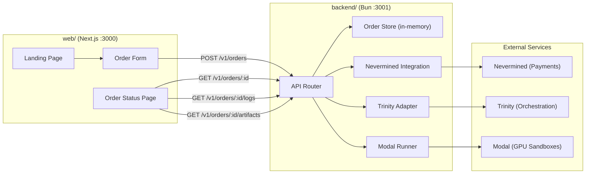
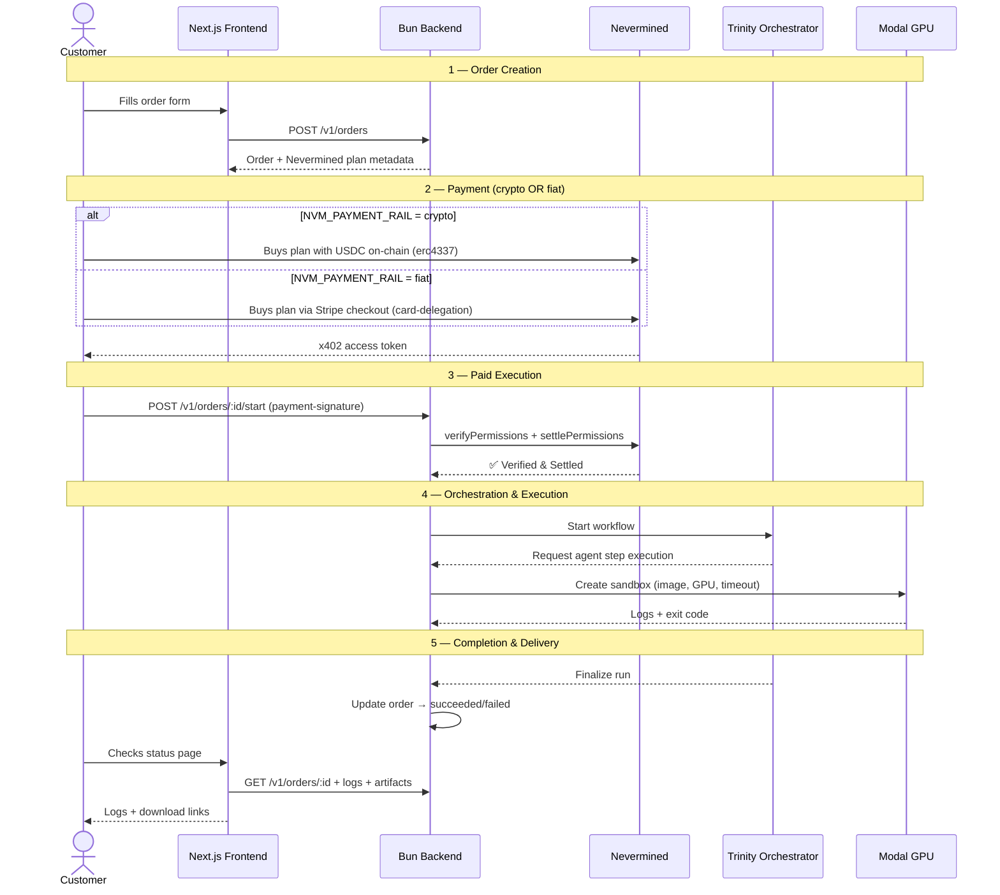

# CloudAGI

CloudAGI is organized as two separate apps:

- `backend/` — Bun API, Nevermined payment gating, Trinity orchestration adapter, Modal execution
- `web/` — Next.js frontend

The backend is a direct AI orchestration service. A customer creates an order, pays for access through Nevermined with either a crypto or fiat-priced plan, CloudAGI triggers a fixed Trinity workflow, executes each agent step in Modal sandboxes, and returns logs plus artifacts.

This repo implements the first transaction path. It is intentionally not a marketplace, not a provider network, and not a multi-tenant control plane.

## Architecture



## Transaction Flow



## Stack

- Bun + TypeScript backend in [`backend/`](./backend)
- Trinity orchestration triggered over HTTP/API
- Modal JavaScript SDK for per-agent sandbox execution
- Nevermined Payments SDK for crypto or Stripe-backed fiat plans plus x402 payment gating
- Next.js 16 + React + Tailwind + TypeScript frontend in [`web/`](./web)

## What Exists

- Marketing / order frontend in [`web/app/page.tsx`](./web/app/page.tsx)
- Order status frontend in [`web/app/orders/[id]/page.tsx`](./web/app/orders/[id]/page.tsx)
- Order creation endpoint: `POST /v1/orders`
- Order lookup endpoint: `GET /v1/orders/:id`
- Paid execution endpoint: `POST /v1/orders/:id/start`
- Logs endpoint: `GET /v1/orders/:id/logs`
- Artifact endpoints:
  - `GET /v1/orders/:id/artifacts`
  - `GET /v1/orders/:id/artifacts/:name`
- Agent discovery document: `GET /.well-known/agent.json`
- Nevermined registration script: `bun run register:nevermined`

## Repo Layout

```text
CloudAGI/
├── backend/      # Bun API app
│   ├── src/
│   ├── scripts/
│   ├── workflows/
│   └── .env
├── web/          # Next.js frontend app
└── docs/         # Product / implementation notes
```

## Run Locally

You need two processes: backend and frontend.

Before starting, clear any stale local listeners and old Cloudflare tunnels:

```bash
cd backend
bun run dev:clear
```

### 1. Backend

From `backend/`:

```bash
cd backend
bun install
bun run dev
```

Backend URL:

- [http://localhost:3001](http://localhost:3001)

Useful backend routes:

- [http://localhost:3001/v1/health](http://localhost:3001/v1/health)
- [http://localhost:3001/.well-known/agent.json](http://localhost:3001/.well-known/agent.json)

### 2. Frontend

In a second terminal:

```bash
cd web
bun install
cp .env.example .env.local
bun run dev
```

Frontend URL:

- [http://localhost:3000](http://localhost:3000)

### 3. Cloudflare Tunnel

If you need a public backend URL for Nevermined:

```bash
cd backend
bun run dev:tunnel
```

This always tunnels the backend on `3001` and kills any older `cloudflared` process first.

Important:

- The quick Tunnel URL changes every time you restart it.
- If you want `/.well-known/agent.json` and Nevermined discovery to point at the current public URL, update `APP_BASE_URL` in [`.env`](./.env) to the new tunnel URL.
- If your Nevermined agent has already been registered, update the agent metadata after changing `APP_BASE_URL`.

## Environment Files

### Backend env

The Bun API reads config from [`backend/.env`](./backend/.env).

Important backend variables:

- `PORT`
- `HOST`
- `APP_BASE_URL`
- `ADMIN_KEY`
- `CORS_ORIGIN` — allowed origin for CORS (default: `https://cloudagi.org`, use `*` for local dev)
- `MODAL_APP_NAME`
- `MODAL_IMAGE`
- `MODAL_ENVIRONMENT_NAME`
- `MODAL_GPU`
- `MODAL_TIMEOUT_SECS`
- `TRINITY_BASE_URL`
- `TRINITY_API_KEY`
- `TRINITY_SYSTEM_NAME`
- `TRINITY_ORCHESTRATOR_AGENT`
- `TRINITY_SHARED_SECRET`
- `NVM_API_KEY`
- `NVM_ENVIRONMENT`
- `NVM_PAYMENT_RAIL`
- `NVM_AGENT_ID`
- `NVM_PLAN_ID`
- `NVM_BUILDER_ADDRESS`
- `NVM_USDC_ADDRESS`
- `CLOUDAGI_PRICE_AMOUNT`
- `CLOUDAGI_PAYMENT_CURRENCY`
- `CLOUDAGI_PRICE_LABEL`
- `CLOUDAGI_PRICE_UNITS`

### Frontend env

The Next app reads config from [`web/.env.local`](./web/.env.example).

Important frontend variables:

- `BACKEND_URL=http://127.0.0.1:3001`
- `NEXT_PUBLIC_API_BASE_URL=`

Notes:

- If `NEXT_PUBLIC_API_BASE_URL` is empty, the frontend uses Next rewrites from [`web/next.config.ts`](./web/next.config.ts) and proxies `/api/*` to `BACKEND_URL`.
- For normal local development, the default `BACKEND_URL=http://127.0.0.1:3001` is correct.

## Runtime Scripts

- `bun run dev:clear`
  Clears local listeners on `3000`, `3001`, and `3002`, and kills existing `cloudflared` processes.
- `bun run dev`
  Starts the Bun backend on `3001`.
- `cd web && bun run dev`
  Starts the Next frontend on `3000`.
- `bun run dev:tunnel`
  Starts a fresh Cloudflare quick tunnel to the backend on `3001`.

## Modal Auth

CloudAGI uses the local Modal profile if one exists.

On this machine, Modal is already configured through `~/.modal.toml`, so local development does not need `MODAL_TOKEN_ID` or `MODAL_TOKEN_SECRET` in `backend/.env`.

You only need explicit Modal env vars when running on a machine that does not already have a Modal profile configured.

## Nevermined Setup

The paid start endpoint depends on Nevermined.

If these are missing:

- `NVM_API_KEY`
- `NVM_AGENT_ID`
- `NVM_PLAN_ID`

then the app still boots, but `POST /v1/orders/:id/start` returns `503`.

To register the CloudAGI plan after filling the Nevermined values:

```bash
cd backend
bun run register:nevermined
```

If you are registering manually through the Nevermined dashboard instead of the script:

| Field                           | Value                                         |
| ------------------------------- | --------------------------------------------- |
| **Agent definition URL**        | `{APP_BASE_URL}/.well-known/agent.json`       |
| **Protected API Endpoint URLs** | `POST` → `{APP_BASE_URL}/v1/orders/:id/start` |

Where `{APP_BASE_URL}` is your public backend URL, for example `https://abc123.trycloudflare.com` from a Cloudflare tunnel or `https://api.cloudagi.org` in production.

That script uses:

- the configured payment rail in `NVM_PAYMENT_RAIL`
- the configured USDC token address in `NVM_USDC_ADDRESS` when using crypto
- the receiving address in `NVM_BUILDER_ADDRESS`
- the current CloudAGI offer name, display price, and raw registration units from `backend/.env`

## Payment Flow

1. Customer creates an order in the frontend.
2. Backend returns the order plus Nevermined plan metadata when configured.
3. Customer orders the plan using the configured Nevermined payment rail.
4. Customer generates an x402 access token.
5. Customer calls `POST /v1/orders/:id/start` with `payment-signature`.
6. CloudAGI verifies and settles the payment through Nevermined.
7. CloudAGI triggers the fixed Trinity system for the order.
8. Trinity requests agent-step execution from CloudAGI.
9. CloudAGI runs each requested step in a dedicated Modal sandbox.
10. Logs and artifacts are exposed through the order status page.

## Current Limitations

- Order state is in-memory. Restarting the backend clears orders.
- Artifacts are written to `data/artifacts/`.
- The backend is API-only; the UI now lives entirely in [`web/`](./web).
- A real paid transaction still requires valid Nevermined credentials, `NVM_AGENT_ID`, `NVM_PLAN_ID`, and a reachable public deployment URL.
- The current plan still needs a real subscriber purchase and a fresh x402 token before Nevermined verification will pass.
- Failed Nevermined verification now returns `402` with a payment challenge and troubleshooting message instead of a raw `500`.

## Validation Commands

Backend:

```bash
cd backend
bun run typecheck
```

Frontend:

```bash
cd web
bun run typecheck
bun run build
```

## Production Deployment

A [`backend/.env.production`](./backend/.env.production) template is included with all required variables for VPS deployment.

### Frontend (Vercel)

```bash
cd web
vercel --prod
```

Set these env vars in Vercel:

- `NEXT_PUBLIC_API_BASE_URL=https://api.cloudagi.org`
- `BACKEND_URL=https://api.cloudagi.org`

Configure `cloudagi.org` as a custom domain in Vercel, then add a CNAME record in Cloudflare:

- `cloudagi.org` → `cname.vercel-dns.com` (proxied)

### Backend (Docker on VPS)

```bash
cd backend
docker build -t cloudagi .
docker run --env-file .env.production -p 3000:3000 cloudagi
```

Add an A record in Cloudflare for the VPS:

- `api.cloudagi.org` → VPS IP (proxied)

Cloudflare proxy handles SSL termination — the backend only needs to expose port 3000 over HTTP.

## Important Files

- [`backend/.env`](./backend/.env)
- [`backend/.env.production`](./backend/.env.production)
- [`web/.env.example`](./web/.env.example)
- [`backend/src/index.ts`](./backend/src/index.ts)
- [`backend/src/jobs/modal.ts`](./backend/src/jobs/modal.ts)
- [`backend/src/payments/nevermined.ts`](./backend/src/payments/nevermined.ts)
- [`backend/src/scripts/register-nevermined.ts`](./backend/src/scripts/register-nevermined.ts)
- [`web/app/page.tsx`](./web/app/page.tsx)
- [`web/app/orders/[id]/page.tsx`](./web/app/orders/[id]/page.tsx)
- [`docs/plans/2026-03-06-cloudagi-first-transaction.md`](./docs/plans/2026-03-06-cloudagi-first-transaction.md)
